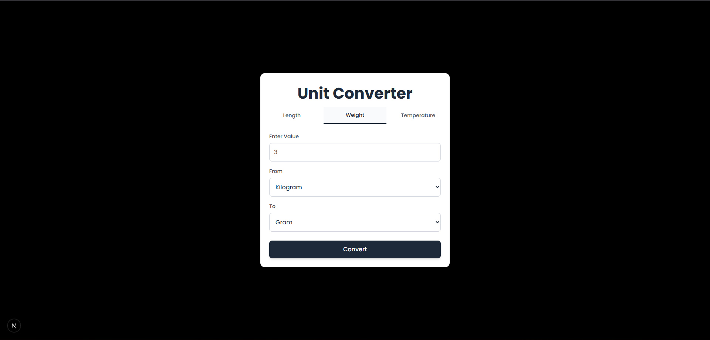

# Unit Converter

A Java-based Unit Converter application with a modern Next + TypeScript frontend.

## Features
- Convert Length, Weight, and Temperature units
- Simple and responsive UI
- Java backend handling conversion logic

## Tech Stack
- Backend: Java (Spring Boot)
- Frontend: Next.js, TypeScript
- Styling: CSS / Tailwind

## Screenshots

### Home Page

### Conversion Result

## How to Run
### Frontend
The frontend of this project is deployed on **Vercel**.

Live Demo: https://unit-converter-fmq8u2ls8-exoluys-projects.vercel.app/

### Backend
The backend is implemented using **Java Spring Boot** and contains all unit conversion logic.
It runs locally and exposes REST APIs consumed by the Next.js frontend.
The backend is not deployed currently.
